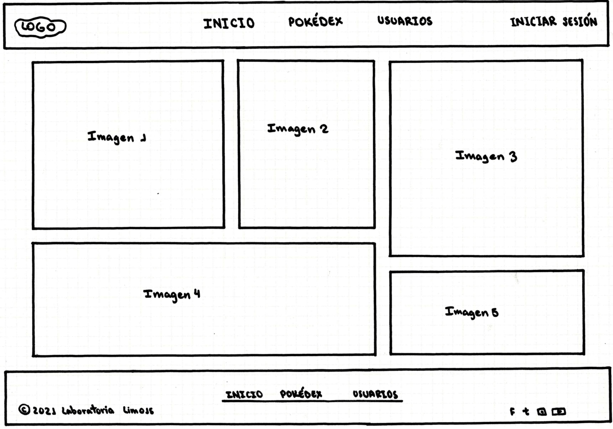
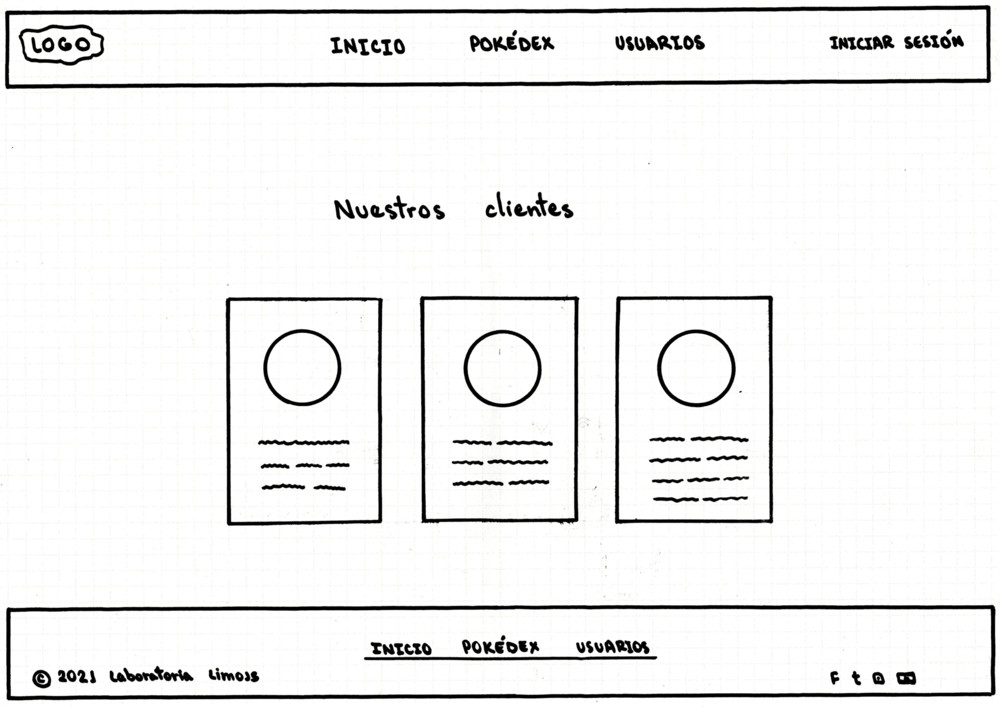
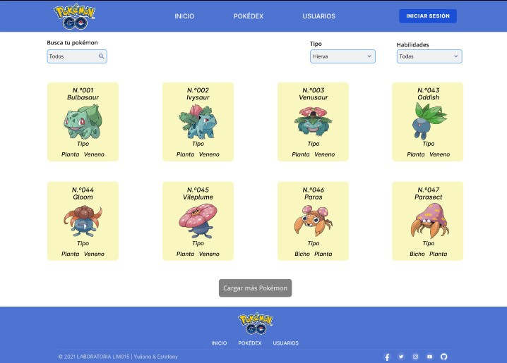
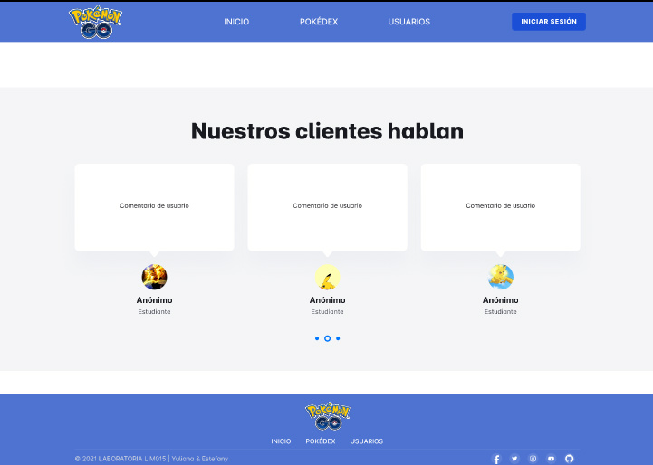

# POKÉCARDS

## Índice

- [1. Definición del proyecto](#1-definición-del-proyecto)
- [2. Investigación UX](#2-investigación-ux)
- [3. Prototipos](#3-prototipos)
- [4. Objetivos de aprendizaje](#4-objetivos-de-aprendizaje)

---

## 1. DEFINICIÓN DEL PROYECTO

PokeCards es una website complementaria para los jugadores del PokemonGO, que desean conocer información adicional acerca de los pokemones para mejorar
su desempeño en el juego.

---

## 2. INVESTIGACIÓN UX

### Usuarios

Jugadores de PokemonGO y personas que quieren iniciarse en el juego.

### Necesidades del Usuario

- Los Pokémon tienen características únicas que determinan las
  decisiones que toma el usuario (tipo, debilidad, peso, multiplicador, etc.)
- Un maestro Pokémon antes de salir a cazar los Pokémon tienen
  que: saber el top 10 de frecuencia de aparición de los Pokémon.
- Los Pokémon tienen distintos tipos y debilidades de combate.
  Estas características son importantes cuando un maestro Pokémon elige
  al Pokémon más adecuado para su batalla. Hay veces que tiene que elegir
  a los que tienen menos cantidad de debilidades y saber de qué tipo son.

### Historia de Usuario

- “Yo jugador de PokemonGO quiero saber el top 10 de los Pokémon, ya sea
  por la característica de mi preferencia.”

  - Ubicarse en la página de Inicio y poder ver el Top 10.
  - Poder acceder a información despegable de las características
    del Pokemon.

- “Yo como jugador de PokemonGO quiero filtrar por tipo, región y por
  orden alfabético para conocer que Pokémon hay por región y sus datos.”
  - Ingresar a la Pokedex
  - Filtrar por Tipo
  - Filtrar por región
  - Ordenar alfabéticamente.

---

## 3. PROTOTIPOS

### Prototipo de baja fidelidad

### Prototipo de alta fidelidad

---

## 4. OBJETIVOS DE APRENDIZAJE

El objetivo principal de este proyecto es que aprendas a diseñar y construir una
interfaz web donde se pueda visualizar y manipular data, entendiendo lo que el
usuario necesita.

### HTML y CSS

- [ ] [Uso de HTML semántico.](https://developer.mozilla.org/en-US/docs/Glossary/Semantics#Semantics_in_HTML)
- [ ] [Uso de selectores de CSS.](https://css-tricks.com/almanac/selectors/)
- [ ] Construir tu aplicación respetando el diseño realizado (maquetación).
- [ ] [Uso de flexbox en CSS.](https://css-tricks.com/snippets/css/a-guide-to-flexbox/)

### DOM y Web APIs

- [ ] [Uso de selectores del DOM](https://developer.mozilla.org/es/docs/Referencia_DOM_de_Gecko/Localizando_elementos_DOM_usando_selectores).
- [ ] [Manejo de eventos del DOM.](https://www.w3schools.com/js/js_events.asp)
- [ ] [Manipulación dinámica del DOM.](https://developer.mozilla.org/es/docs/Referencia_DOM_de_Gecko/Introducci%C3%B3n)
      (appendChild |createElement | createTextNode| innerHTML | textContent | etc.)

### JavaScript

- [ ] Uso de condicionales (if-else | switch | operador ternario)
- [ ] [Uso de bucles (for | for..in | for..of | while)](https://developer.mozilla.org/es/docs/Web/JavaScript/Guide/Bucles_e_iteraci%C3%B3n)
- [ ] [Uso de funciones (parámetros | argumentos | valor de retorno)](https://developer.mozilla.org/es/docs/Web/JavaScript/Referencia/Funciones)
- [ ] [Manipular arrays (filter | map | sort | reduce)](https://code.tutsplus.com/es/tutorials/how-to-use-map-filter-reduce-in-javascript--cms-26209)
- [ ] [Manipular objects (key | value)](https://developer.mozilla.org/es/docs/Web/JavaScript/Referencia/Objetos_globales/Object)
- [ ] [Uso ES modules](https://developer.mozilla.org/es/docs/Web/JavaScript/Guide/M%C3%B3dulos) ([`import`](https://developer.mozilla.org/en-US/docs/Web/JavaScript/Reference/Statements/import)
      | [`export`](https://developer.mozilla.org/en-US/docs/Web/JavaScript/Reference/Statements/export))
- [ ] [Diferenciar entre expression y statements.](https://openclassrooms.com/en/courses/4309531-descubre-las-funciones-en-javascript/5108986-diferencia-entre-expresion-y-sentencia)
- [ ] [Diferenciar entre tipos de datos atómicos y estructurados.](https://developer.mozilla.org/es/docs/Web/JavaScript/Data_structures)

### Testing

- [ ] [Testeo unitario.](https://jestjs.io/docs/es-ES/getting-started)

### Estructura del código y guía de estilo

- [ ] [Organizar y dividir el código en módulos (Modularización)](https://medium.com/@sebastianpaduano/modularizaci%C3%B3n-en-javascript-538bd6c75fa)
- [ ] Uso de identificadores descriptivos ([Nomenclatura](http://snowdream.github.io/javascript-style-guide/javascript-style-guide/es/naming-conventions.html) | [Semántica](https://geekytheory.com/semantica-coder))
- [ ] Uso de linter (ESLINT)

### Git y GitHub

- [ ] [Uso de comandos de git (add | commit | pull | status | push)](https://github.com/jlord/git-it-electron)
- [ ] Manejo de repositorios de GitHub (clone | fork | gh-pages)
- [ ] Colaboración en Github (branches | pull requests | |[tags](https://git-scm.com/book/en/v2/Git-Basics-Tagging))

### UX

- [ ] Diseñar la aplicación pensando y entendiendo al usuario.
- [ ] Crear prototipos para obtener feedback e iterar.
- [ ] Aplicar los principios de diseño visual (contraste, alineación, jerarquía)
- [ ] Planear y ejecutar tests de usabilidad.
